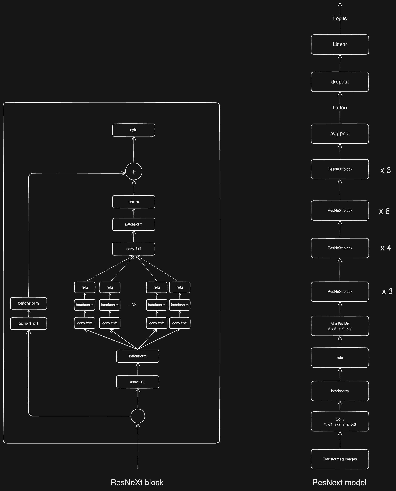

# Emotions Detector

## Preliminary Steps

1. Download the dataset from the following link: [emotions-detector.zip](https://assets.01-edu.org/ai-branch/project3/emotions-detector.zip)
2. Extract the dataset and move the CSV files into the "data" folder.
3. To start TensorBoard, use the following command:
   ```bash
   tensorboard --logdir=runs
   ```

# Run the code

to run the code

1. Make a venv
``` bash
   python -m venv emotions_detector
```

2. activte the venv
``` bash
   source ./emotions_detector/scripts/activate
```

3. install the requirments
``` bash
   pip install -r requirements.txt
```
4. download the models latest checkpoint from (https://drive.google.com/file/d/11ce8kRUZ8rETBFT84_TuasEm7MWgLkVv/view?usp=drive_link) and place it in the model folder if the ./model/my_own_model.pkl is not there yet

5. test the model
``` bash
   python -m scripts.predict
```

6. start the webcam script

``` bash
   python webcam.py
```

## Model

The model used is a ResNeXt architecture with a Convolutional Block Attention Module (CBAM).

- [ResNeXt Paper](https://arxiv.org/pdf/1611.05431)
- [CBAM Paper](https://arxiv.org/abs/1807.06521)



## Model Description

My model is called a ResNeXt model with CBAM. It's like a mix of three different types of models: VGG, ResNet, and Inception. You can see how the model looks by checking the picture called "model.png".
To teach the model to do its job well, I trained it five times, which we call "folds". Each time, I trained it for 150 rounds, known as "epochs". Altogether, this training took 50 hours.
A ResNeXt model is a type of deep learning model used for recognizing patterns, such as images. It's part of a family of models known as convolutional neural networks (CNNs), which are great at tasks like image classification.
The "ResNeXt" name comes from combining two ideas:
ResNet: This is short for "Residual Network." It has a special way of learning by using shortcut connections. These shortcuts help the model learn better by making it easier to pass information through the layers.
Next: This part of the name means that the model is taking the next step in improving how networks work. It does this by using a group of paths or branches at each layer, which are called "cardinality." This way, instead of just having one path for the data to flow through, it has multiple paths, making the model more flexible and powerful.
In simple terms, a ResNeXt model is like a more advanced version of a ResNet, with more paths for data to travel through, which helps it learn and recognize patterns in a more effective way.
A ResNeXt model with CBAM is great for detecting emotions in images, even if you have only 25,000 images, for several reasons:
Advanced Features: The ResNeXt model combines the best parts of VGG, ResNet, and Inception models. This mix helps it learn complex patterns and details in images, which is essential for recognizing different emotions.
CBAM Attention Mechanism: CBAM stands for Convolutional Block Attention Module. It helps the model focus on the important parts of an image that show emotions, like a smile, while ignoring the less important parts. This makes the model more accurate.
Efficient Learning: Because the ResNeXt model has multiple paths for data to travel through, it can learn faster and more effectively. This is especially useful when you don't have a huge amount of data. With 25,000 images, the model can still learn to detect emotions well because it makes the most out of each image.
Generalization: The combination of ResNeXt and CBAM helps the model generalize better. This means it can apply what it learned from the 25,000 training images to new, unseen images. This is crucial for tasks like emotion detection where the model needs to perform well on a variety of faces and expressions.
In summary, the ResNeXt model with CBAM is powerful and efficient, making it an excellent choice for detecting emotions even with a relatively small dataset of 25,000 images.


### Initialization

The weights for the convolutional and linear layers are initialized using He initialization (Kaiming Normal).

- [He Initialization Paper](https://arxiv.org/abs/1502.01852)

The initial loss is approximately 1.9, which is appropriate since the initial learning rate should be log(1/C) where C is the number of classes (C = 7).

# Previous models

Initial Model (ResNet50):
Used standard initialization.
    Weak data augmentation.
    No oversampling.
    Step learning rate scheduler (30 epochs, gamma 0.1).
    Achieved ≈ 65% validation accuracy and test accuracy.

Exploration and Modifications:
Studied research papers and watched Stanford CS231n Winter 2016 lectures.

Tried a normal ResNeXt50 model.
Achieved a peak validation accuracy of ≈ 80% (red line in the graph).

Enhancements (ResNeXt50):
    Increased data augmentation.
    Implemented oversampling.
    Applied label smoothing.
    Used dropout.
    Employed ReduceLROnPlateau with factor 0.1 and patience 7.
Resulted in ≈ 87% validation accuracy.
Test accuracy was 74%.

Further Improvement (CBAM Module):
    Implemented the CBAM (Convolutional Block Attention Module) module.
Achieved 82% test accuracy.

I also tried to use a DeiT model (Data efficent iamge transformer) but when they (meta) say "Data efficent" they "only" use Imagenet with 14,197,122 images. 
I only got around 65% using the DeiT model and my ResNeXt50 with CBAM as the teacher model.

## Hyperparameters
- Train resolution: 224
- Test resolution: 224
- Epochs: 150
- Batch size: 128
- Optimizer: AdamW
- Learning rate (lr): 1e-3
- Weight decay: 0.03
- Label smoothing: 0.1

# Ingredients
- ReduceLROnPlateau (factor=0.1, patience=0.7)
- AdamW (lr=1-e3, weight_decay=0.03)
- Crossentropyloss(label_smoothing=0.1)
- Oversampling
- Data augmentation
   - RandomHorizontalFlip(p=0.5)
   - RandomRotation(degrees=15)
   - ColorJitter(brightness=0.2, contrast=0.2, saturation=0.2, hue=0.1)
   - RandomAffine(degrees=15, translate=(0.1, 0.1), scale=(0.9, 1.1))
   - RandomErasing(p=0.3, scale=(0.02, 0.33), ratio=(0.3, 3.3), value='random')
- Normalize Images

## Useful Links

- [Project Description](https://github.com/01-edu/public/blob/master/subjects/ai/emotions-detector/README.md)
- [Dataset](https://www.kaggle.com/competitions/challenges-in-representation-learning-facial-expression-recognition-challenge/overview)
- [DeiT Paper](https://arxiv.org/abs/2012.12877)
- [DeiT Video](https://www.youtube.com/watch?v=viClVMxiwI0)
- [ResNet Paper](https://arxiv.org/pdf/1512.03385)
- [He Initialization Paper](https://arxiv.org/abs/1502.01852)
- [ResNet Strikes Back: Improved Training Procedure in TIMM](https://arxiv.org/abs/2110.00476)
- [CBAM Paper](https://arxiv.org/abs/1807.06521)
- [ResNeXt Paper](https://arxiv.org/pdf/1611.05431)

The model can be found at
https://drive.google.com/file/d/11ce8kRUZ8rETBFT84_TuasEm7MWgLkVv/view?usp=drive_link
